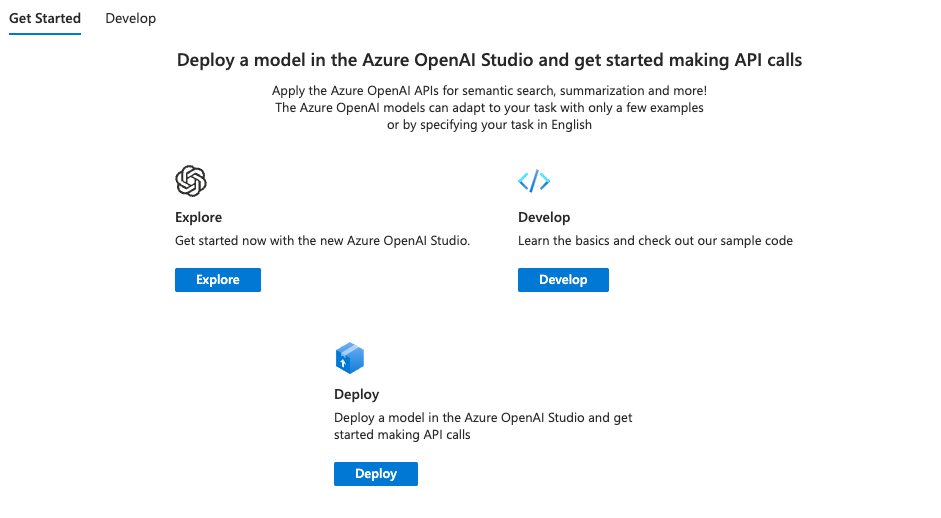
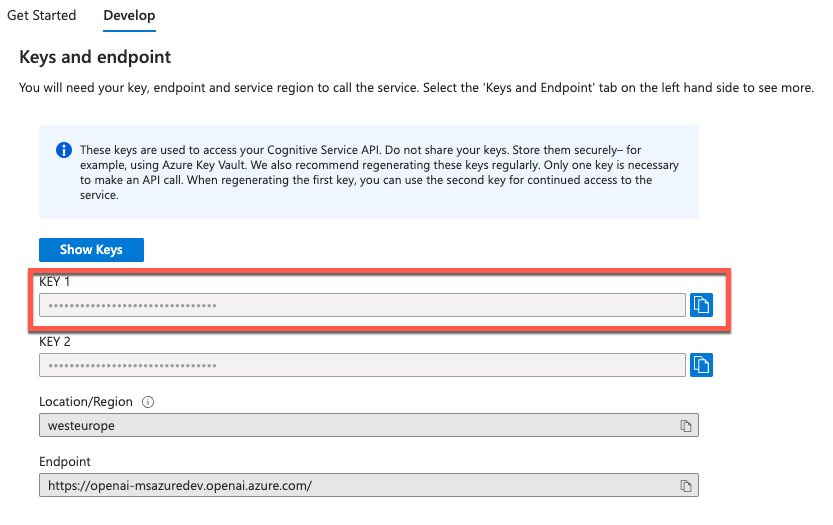
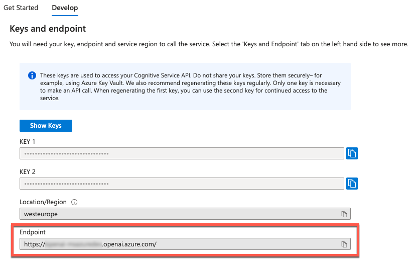

# Setup for the labs

Here's a detailed walkthrough of what you need to get started with the labs.

## OpenAI Model Deployments

During these labs, we'll make use of a *Completions* model and an *Embeddings* model, so you'll need access to at least one of each of these.

Someone may have already set these up for you to use, however if you need to deploy your own you can follow these instructions.

1. Check if you already have an Azure OpenAI service deployed. Go to the Azure Portal and in the top search bar, enter `openai`. You'll then see **Azure OpenAI** listed under **Services**.  Click on **Azure OpenAI** to see all deployed services.


On the next page, you should see a list of deployed services. If you have one and are able to access it, click on it. Otherwise, click the **+ Create** button at the top of the page to create a new Azure OpenAI service.


2. With a new or existing instance of Azure OpenAI deployed, click on the instance. On the main **Overview** page, you will see a **Get Started** section. Click on the **Develop** link.



On the **Develop** page you will see values for **Key 1**, **Key 2**, **Location / Region** and **Endpoint**. You will need the **Key 1** and **Endpoint** details later on.

3. Back at the **Overview** page in the **Get Started** section, click on **Explore**.  This will launch the **Azure AI Studio**. Once in Azure AI Studio, click on the **Deployments** link on the left hand side.


4. In the deployments section, we can make sure that we have one of each of the required models available.


You can see above that we have a *completions* model `gpt-35-turbo` and an *embeddings* model `text-embedding-ada-002`. If you have both of these, then you're good to go. If not, click on the **+ Create new deployment** link and follow the steps to create two deployments. Ensure that one model deployment uses `text-embedding-ada-002` and the other uses a completions model such as `gpt-35-turbo`.

Make a note of both the deployment name and the model name for each of the two deployments.

5. Finally, we need to update a configuration file in this repo so that the labs are able to make use of your Azure OpenAI service. In the root of this repository, you will see a file named `env.example`. Make a copy of this file in the same location (the root of the repository) and rename the file to `.env` (don't forget the period at the beginning of the filename!)

Here's a detailed list of what you need to enter into the `.env` file and where to find the information you need to supply.

The first item `OPENAI_API_TYPE` is always set to `azure`. 

```
OPENAI_API_TYPE = "azure"
```

The `OPENAI_API_KEY` is the **Key 1** value you found on the **Develop** tab of the **Overview** page for the **Azure OpenAI Service** in the Azure portal.



```
OPENAI_API_KEY = "5a8d1ea15ba00f1a833ab1ff245cdb0a"
```

The `OPENAI_API_BASE` is the **Endpoint** value you found on the **Develop** tab of the **Overview** page for the **Azure OpenAI Service** in the Azure portal.



It will look similar to the below, ending with `.openai.azure.com`.

```
OPENAI_API_BASE = "https://my-openaiservice.openai.azure.com/"
```

The `OPENAI_API_VERSION` is used for the Azure OpenAI API to determine which version of the API to use. The value below should be fine, but you can view available versions of the API at the following link: https://learn.microsoft.com/en-us/azure/cognitive-services/openai/reference#rest-api-versioning

```
OPENAI_API_VERSION = "2023-06-01-preview"
```

The next sections all relate to the models you have deployed in the Azure OpenAI service.

First is `OPENAI_COMPLETION_MODEL`. This is the name of the **completions model**. It's likely to be `gpt-35-turbo`, but if you're using a different completions model, provide the name of the model here.

Note for this value, it's the name of the **model**, NOT the name of the **deployment**.


```
OPENAI_COMPLETION_MODEL = "gpt-35-turbo"
```

The next two items are the **deployments** you have created using the Azure OpenAI service. First is the name of the deployment for the completions model and can be found in the **Deployment name** column of the **Deployments** page in Azure AI Studio.


```
AZURE_OPENAI_COMPLETION_DEPLOYMENT_NAME = "gpt35turbo"
```

The final value is the name of the deployment for the embeddings model and can be found in the **Deployment name** column of the **Deployments** page in Azure AI Studio.


```
AZURE_OPENAI_EMBEDDING_DEPLOYMENT_NAME = "embedding"
```

6. With all of the above updates to the `.env` file made, make sure you save the file and then you are ready to start the labs.

**NOTE**: The `.gitignore` file in this repo is configured to ignore the `.env` file, so the secrets such as the API key will not be uploaded to a public repo.